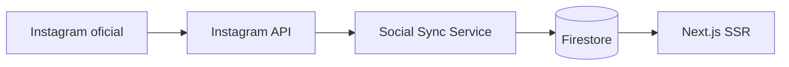
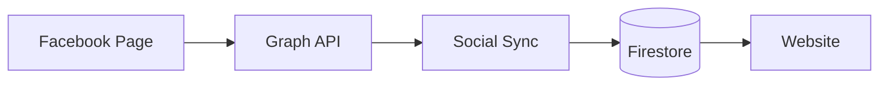
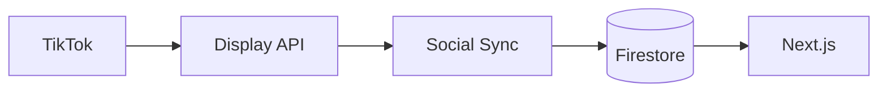
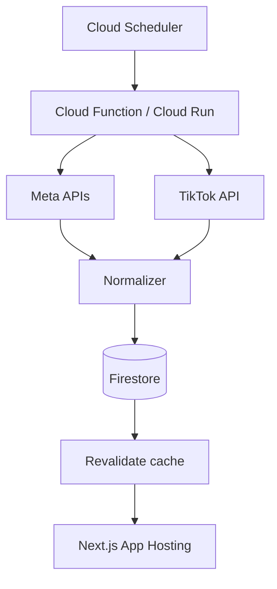
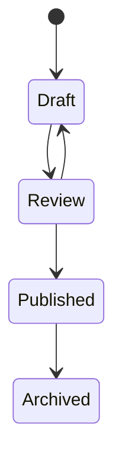
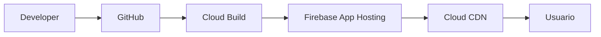
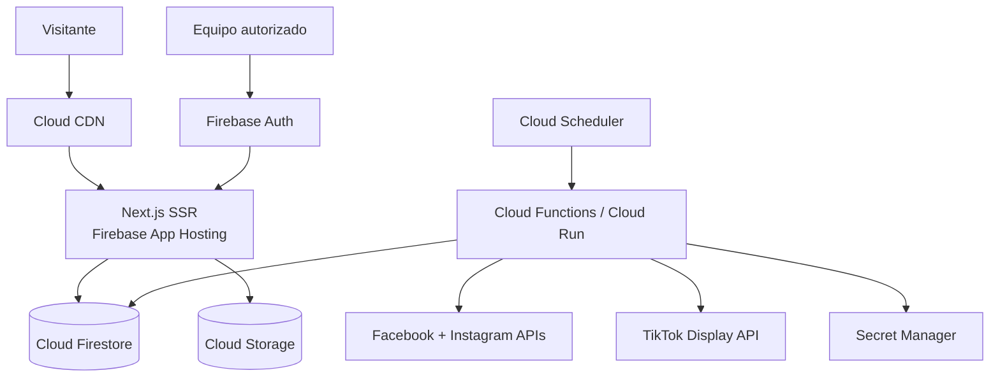

# Plan maestro de producto, UX/UI y arquitectura técnica
## Sitio web informativo de Luis Fernando Balladares — Alcaldía de Zamora

**Versión:** 1.0  
**Fecha:** 17 de septiembre de 2026  
**Objetivo:** construir un sitio web moderno, rápido, accesible, transparente, administrable y con integración automática de publicaciones oficiales de Facebook, Instagram y TikTok.

---

# 1. Decisión tecnológica recomendada

## Stack principal

| Capa | Tecnología recomendada | Motivo |
|---|---|---|
| Framework | **Next.js + App Router + TypeScript** | SSR, Server Components, SEO, rutas dinámicas, metadata y excelente integración con Firebase App Hosting |
| Hosting SSR | **Firebase App Hosting** | Pensado específicamente para aplicaciones web modernas con SSR |
| Base de datos | **Cloud Firestore** | Contenido, agenda, propuestas, social feed normalizado, formularios y configuración |
| Archivos | **Cloud Storage for Firebase** | Fotos oficiales, documentos, PDFs, imágenes OG y material multimedia propio |
| Autenticación | **Firebase Authentication** | Acceso exclusivo al panel administrativo |
| Seguridad antiabuso | **Firebase App Check** | Protección de endpoints y formularios |
| Backend auxiliar | **Cloud Functions 2nd gen / Cloud Run** | Sincronización de redes, webhooks, tareas programadas y procesos de backend |
| Tareas programadas | **Cloud Scheduler** | Sincronización periódica de Facebook, Instagram y TikTok |
| Secretos | **Google Secret Manager** | Tokens/API secrets fuera del código |
| Estilos | **Tailwind CSS** | Sistema consistente y rápido de implementar |
| Componentes accesibles | **shadcn/ui + Radix primitives** | Buen punto de partida para accesibilidad y consistencia |
| Iconos | **Lucide** | Iconografía simple y consistente |
| Animación | **Motion** de forma muy moderada | Microinteracciones sin sacrificar rendimiento |
| Testing | **Vitest + Playwright** | Pruebas unitarias y E2E |
| Repositorio | **GitHub** | App Hosting soporta despliegue continuo desde GitHub |
| CI/CD | **Firebase App Hosting + GitHub** | Deploy automático desde rama de producción |

## Decisión concreta

> **Usar Next.js con TypeScript desplegado en Firebase App Hosting.**

No usaría Firebase Hosting clásico para este proyecto si el objetivo es SSR completo. App Hosting es la opción más limpia para Next.js SSR dentro del ecosistema Firebase.

---

# 2. Principios rectores del producto

El sitio debe ser:

1. **Informativo antes que promocional**
2. **Rápido en móviles de gama media y baja**
3. **Muy fácil de navegar**
4. **Accesible**
5. **Transparente sobre quién publica y de dónde sale la información**
6. **Actualizable sin tocar código**
7. **Automático en redes sociales**
8. **SEO-first**
9. **Resistente a caídas de APIs externas**
10. **Sin dark patterns**
11. **Sin obligar a entregar datos personales para entrar**
12. **Con trazabilidad de cambios importantes**

---

# 3. Referencia visual: qué tomar del splash de Ocasio-Cortez

La referencia `ocasiocortez.com/splash` funciona porque reduce la primera pantalla a muy pocas decisiones:

- mensaje principal;
- formulario;
- enlace para continuar;
- redes;
- aviso legal.

Para este proyecto tomaría **la simplicidad**, pero no copiaría la estructura literalmente.

## Mejoras propuestas

### No bloquear el acceso con un formulario

El visitante siempre debe ver un botón claro:

**Entrar al sitio**

El formulario de contacto o suscripción puede ser secundario.

### Splash opcional

En la primera visita:

```text
┌────────────────────────────────────────────────────────────┐
│ LOGO                                      Menú / Entrar     │
│                                                            │
│          [Retrato de Luis]                                 │
│                                                            │
│                          YO LUCHO                           │
│                          POR ZAMORA                         │
│                                                            │
│                          Conoce trayectoria                 │
│                          Conoce propuestas                  │
│                          Entrar al sitio                    │
│                                                            │
└────────────────────────────────────────────────────────────┘
```

En móvil:

```text
┌───────────────────────┐
│ Logo           Menú   │
│                       │
│      RETRATO          │
│                       │
│   YO LUCHO            │
│   POR ZAMORA          │
│                       │
│ [Conocer propuestas]  │
│ [Entrar al sitio]     │
└───────────────────────┘
```

La navegación pública no debe depender de entregar email, teléfono o ubicación.

---

# 4. Identidad visual inicial a partir del material recibido

La pieza proporcionada permite definir una primera dirección visual.

## Color base detectado

El fondo dominante de la pieza está aproximadamente en:

```css
--brand-orange: #E1451C;
```

## Paleta propuesta

```css
:root {
  --brand-orange: #E1451C;
  --brand-orange-dark: #B93616;

  --black: #0A0A0A;
  --charcoal: #191919;
  --white: #FFFFFF;
  --off-white: #F7F7F4;

  --gray-100: #F1F1EF;
  --gray-300: #D5D5D0;
  --gray-600: #666660;
  --gray-900: #181816;
}
```

El verde del logotipo debe obtenerse del archivo gráfico original, no adivinarse desde una imagen comprimida.

## Tipografía

### Texto/UI
- **Inter**
- alternativa: **Manrope**

### Titulares
- **Archivo Black**
- alternativa: **Anton**

No recrear el logotipo tipográficamente. Solicitar el logo original en **SVG** o PNG transparente.

---

# 5. Sistema visual

## Radios

```css
--radius-sm: 8px;
--radius-md: 14px;
--radius-lg: 24px;
--radius-xl: 36px;
```

## Espaciado

Sistema base de 4 px:

```text
4, 8, 12, 16, 24, 32, 48, 64, 96, 128
```

## Anchura máxima

```css
max-width: 1280px;
```

Contenido editorial:

```css
max-width: 760px;
```

## Sombras

Usar muy pocas.

El diseño debe descansar en:
- contraste;
- tipografía;
- fotografía;
- espacio;
- jerarquía.

---

# 6. Principios y leyes de UX aplicadas

## Ley de Hick

Cuantas más opciones se presentan, mayor es el tiempo de decisión.

### Aplicación

Menú principal máximo:

1. Inicio
2. Luis
3. Propuestas
4. Zamora
5. Noticias
6. Contacto

No crear un menú con 12–15 elementos.

---

## Ley de Fitts

Los elementos importantes deben ser fáciles de alcanzar y suficientemente grandes.

### Aplicación móvil

Altura mínima recomendada de controles:

```text
44–48 px
```

CTAs nunca pegados entre sí.

---

## Ley de Jakob

Los usuarios esperan que una web funcione como otras webs que ya conocen.

### Aplicación

- logo arriba a la izquierda;
- navegación arriba;
- menú hamburguesa en móvil;
- enlaces subrayados cuando corresponde;
- footer completo;
- formularios convencionales.

No sacrificar usabilidad buscando originalidad visual.

---

## Efecto de posición serial

Las personas recuerdan mejor el inicio y final de una secuencia.

### Aplicación

Homepage:

1. Identidad / contexto
2. Información esencial
3. Trayectoria
4. Propuestas
5. Territorio
6. Publicaciones
7. Contacto / redes
8. Footer legal

---

## Principios Gestalt

### Proximidad
Información relacionada junta.

### Similitud
Todas las tarjetas de propuestas comparten estructura.

### Continuidad
Las secciones deben guiar visualmente hacia abajo.

### Figura/fondo
Fotografía y texto siempre con contraste suficiente.

---

## Ley de Prägnanz

Preferir formas y composiciones simples.

Evitar:
- degradados innecesarios;
- exceso de sombras;
- cards dentro de cards;
- carruseles automáticos;
- animaciones permanentes.

---

## Umbral de Doherty

La respuesta del sistema debe sentirse inmediata.

### Objetivo

- interacciones de UI instantáneas;
- skeletons solo cuando sean necesarios;
- navegación con prefetch;
- contenido SSR.

---

# 7. Arquitectura de información

## Rutas públicas

```text
/
├── /luis
├── /trayectoria
├── /propuestas
│   ├── /agua-y-saneamiento
│   ├── /ciudad-y-urbanismo
│   ├── /turismo
│   ├── /deporte
│   ├── /educacion
│   ├── /salud
│   ├── /parroquias
│   └── /gestion-municipal
├── /territorio
│   └── /[parroquia]
├── /noticias
│   └── /[slug]
├── /redes
├── /agenda
│   └── /[slug]
├── /documentos
├── /plan-de-trabajo
├── /contacto
├── /privacidad
├── /accesibilidad
└── /transparencia
```

## Administración

```text
/admin
├── /dashboard
├── /paginas
├── /propuestas
├── /trayectoria
├── /noticias
├── /agenda
├── /redes
├── /media
├── /documentos
├── /formularios
├── /usuarios
├── /configuracion
└── /auditoria
```

---

# 8. Homepage

## 8.1 Hero

Desktop:

```text
┌──────────────────────────────────────────────────────────────────┐
│ LOGO        Luis  Propuestas  Territorio  Noticias      Contacto │
├──────────────────────────────────────────────────────────────────┤
│                                                                  │
│     FOTO / CUTOUT              YO LUCHO                           │
│     DE LUIS                    POR ZAMORA                         │
│                                                                  │
│                                [Conocer trayectoria]              │
│                                [Ver propuestas]                   │
│                                                                  │
│                                ↓ Explorar                         │
└──────────────────────────────────────────────────────────────────┘
```

### Requisitos

- `min-height: 100svh`
- fotografía WebP/AVIF;
- imagen responsive;
- texto real HTML, no texto rasterizado;
- `h1` único;
- CTA visible;
- sin autoplay.

---

## 8.2 Franja de navegación rápida

```text
[Trayectoria] [Propuestas] [Agenda] [Redes] [Plan CNE]
```

---

## 8.3 Introducción

Máximo 2–3 párrafos.

Botón:

```text
Conocer trayectoria completa →
```

---

## 8.4 Trayectoria en timeline

```text
2006
Gobernación / Intendencia / Jefatura Política

2017–2019
Prefectura de Zamora Chinchipe

2020–2023
Municipio de Zamora

2023–2024
Prefectura de Zamora Chinchipe

2026
Candidatura a la Alcaldía
```

Cada elemento debe tener:
- cargo;
- institución;
- fechas;
- fuente;
- documento o enlace cuando exista.

---

## 8.5 Propuestas

Grid de 6–8 categorías.

```text
┌──────────────┐ ┌──────────────┐
│ Agua         │ │ Urbanismo    │
│              │ │              │
│ Ver detalle  │ │ Ver detalle  │
└──────────────┘ └──────────────┘
```

Cada propuesta:

```ts
type Proposal = {
  id: string
  slug: string
  title: string
  summary: string
  problem?: string
  actions: string[]
  territory?: string[]
  timeline?: string
  financing?: string
  sourceUrl?: string
  sourceDocument?: string
  status: "draft" | "reviewed" | "published"
}
```

---

# 9. Sección "Zamora"

No limitar la web a hablar de la persona.

Crear un mapa editorial del cantón:

- Zamora
- Cumbaratza
- Guadalupe
- Imbana
- Sabanilla
- San Carlos de las Minas
- Timbara
- otras divisiones/parroquias aplicables

Cada página puede contener:

```text
/parroquia
- descripción
- fotografías
- necesidades documentadas
- propuestas relacionadas
- agenda
- publicaciones relacionadas
```

No inferir necesidades ni opiniones de habitantes sin fuentes.

---

# 10. Feed social unificado

Una sección:

```text
/redes
```

debe mostrar contenido oficial proveniente automáticamente de:

- Instagram
- Facebook
- TikTok

## Principio clave

**No cargar tres SDKs pesados de redes sociales al entrar a la página.**

La web debe guardar una representación normalizada en Firestore y renderizarla como HTML propio.

Solo cargar el reproductor/iframe oficial cuando el visitante lo solicite.

Esto mejora:
- rendimiento;
- privacidad;
- estabilidad visual;
- accesibilidad.

---

# 11. Modelo normalizado de publicaciones

```ts
export type SocialPost = {
  id: string

  platform: "facebook" | "instagram" | "tiktok"
  externalId: string

  authorName: string
  authorHandle?: string

  text?: string

  mediaType:
    | "image"
    | "video"
    | "carousel"
    | "reel"
    | "post"

  canonicalUrl: string

  mediaUrl?: string
  thumbnailUrl?: string
  embedUrl?: string

  publishedAt: Timestamp

  syncedAt: Timestamp
  updatedAt: Timestamp

  status:
    | "active"
    | "deleted"
    | "unavailable"
    | "hidden"

  metrics?: {
    likes?: number
    comments?: number
    shares?: number
    views?: number
  }

  source: {
    accountId: string
    accountName: string
  }
}
```

## Índice de unicidad

```text
platform + externalId
```

Nunca duplicar publicaciones.

---

# 12. Instagram: integración automática

## Opción recomendada

Usar la API oficial de Instagram/Meta.

### Requisitos generales

- cuenta profesional;
- aplicación Meta Developer;
- autorización del propietario;
- conexión correspondiente con el ecosistema Meta;
- token de acceso válido;
- permisos aprobados.

## Flujo



## Datos a guardar

- ID;
- caption;
- tipo;
- permalink;
- fecha;
- thumbnail/media URL si está permitido;
- métricas disponibles.

## Importante

No almacenar indefinidamente URLs temporales de medios.

Programar refresco.

---

# 13. Facebook: integración automática

Usar Graph API para la **Página oficial**, no scraping de HTML.

## Flujo



## Reglas

- trabajar únicamente con cuentas/páginas autorizadas;
- tokens solo en servidor;
- no exponer tokens al navegador;
- no depender del DOM de facebook.com;
- guardar permalink original;
- actualizar métricas con menor frecuencia que el contenido.

---

# 14. TikTok: integración automática

TikTok dispone de Display API.

Requisitos típicos:

- TikTok Developer Account;
- aplicación aprobada;
- Login Kit;
- autorización del propietario;
- scopes:
  - `user.info.basic`
  - `video.list`

## Flujo



Puede recuperarse la lista de videos públicos recientes.

## Fallback

Cuando se disponga de una URL concreta:

```text
TikTok URL → oEmbed → metadata/embed
```

## Importante

Los `cover_image_url` de TikTok pueden expirar.

Por eso:

```text
NO guardar portada como si fuera permanente
SÍ refrescar metadata periódicamente
```

---

# 15. Estrategia de sincronización

## Recomendación

### Contenido
Cada:

```text
15 minutos
```

### Métricas
Cada:

```text
2–6 horas
```

No hace falta consultar métricas cada minuto.

## Arquitectura



---

# 16. Algoritmo de sincronización

Pseudo-código:

```ts
async function syncSocialPosts() {
  const sources = [
    facebookSource,
    instagramSource,
    tiktokSource
  ]

  for (const source of sources) {
    try {
      const posts = await source.fetchRecentPosts()

      for (const post of posts) {
        const normalized = normalize(post)

        await upsertSocialPost({
          key: `${normalized.platform}:${normalized.externalId}`,
          post: normalized
        })
      }

      await markMissingPostsIfNecessary(source)
      await updateSyncStatus(source, "success")
    } catch (error) {
      await logSyncError(source, error)
      await updateSyncStatus(source, "error")
    }
  }
}
```

---

# 17. Resiliencia frente a APIs externas

La homepage **nunca debe depender en tiempo real** de Instagram/Facebook/TikTok.

Incorrecto:

```text
Usuario
↓
Homepage
↓
espera API Instagram
↓
espera API TikTok
↓
render
```

Correcto:

```text
Redes → Sync programado → Firestore
                           ↓
                     Next.js SSR
                           ↓
                        Usuario
```

Si TikTok se cae:
- la web sigue funcionando;
- aparece el último contenido sincronizado;
- el error solo aparece en admin.

---

# 18. Moderación del feed

Para cuentas oficiales propias:

```text
autoPublish = true
```

Pero permitir desde Admin:

```text
Ocultar de la web
Destacar
Fijar arriba
Excluir de homepage
```

No borrar el post original desde el CMS.

---

# 19. CMS / Panel administrativo

## Usuarios

Roles:

```text
SUPER_ADMIN
EDITOR
REVIEWER
```

## Permisos

### SUPER_ADMIN

- todo;
- usuarios;
- configuración;
- tokens indirectamente;
- publicación.

### EDITOR

- páginas;
- noticias;
- agenda;
- propuestas;
- multimedia.

### REVIEWER

- lectura;
- revisión;
- aprobar/bloquear borradores.

---

# 20. Workflow editorial



Todo contenido sensible debe guardar:

```ts
{
  createdBy,
  createdAt,
  updatedBy,
  updatedAt,
  reviewedBy,
  publishedAt
}
```

---

# 21. Colecciones Firestore

```text
siteSettings/
pages/
proposals/
timeline/
territories/
news/
events/
socialPosts/
socialAccounts/
documents/
media/
forms/
formSubmissions/
users/
auditLogs/
syncJobs/
```

---

# 22. Estructura sugerida de `siteSettings`

```ts
{
  siteName: "Luis Balladares",
  slogan: "Yo lucho por Zamora",
  electionLabel: "Alcaldía de Zamora",
  social: {
    facebook: "...",
    instagram: "...",
    tiktok: "..."
  },
  contact: {
    email: "...",
    whatsapp: "..."
  },
  mode: "normal",
  hero: {
    image: "...",
    headline: "...",
    subheadline: "..."
  }
}
```

---

# 23. Modo operativo especial

Añadir:

```ts
mode:
  | "normal"
  | "maintenance"
  | "legal-review"
  | "silence-period"
```

Esto permite cambiar rápidamente banners, formularios o módulos si el equipo legal lo requiere durante el calendario electoral.

No eliminar contenido informativo automáticamente sin revisión jurídica.

---

# 24. Estructura del proyecto Next.js

```text
src/
├── app/
│   ├── (public)/
│   │   ├── page.tsx
│   │   ├── luis/
│   │   ├── trayectoria/
│   │   ├── propuestas/
│   │   ├── territorio/
│   │   ├── noticias/
│   │   ├── redes/
│   │   ├── agenda/
│   │   ├── documentos/
│   │   └── contacto/
│   │
│   ├── admin/
│   │   ├── dashboard/
│   │   ├── proposals/
│   │   ├── news/
│   │   └── social/
│   │
│   ├── api/
│   │   ├── social/
│   │   ├── forms/
│   │   └── revalidate/
│   │
│   ├── robots.ts
│   ├── sitemap.ts
│   └── layout.tsx
│
├── components/
│   ├── ui/
│   ├── layout/
│   ├── home/
│   ├── social/
│   ├── proposals/
│   └── admin/
│
├── lib/
│   ├── firebase/
│   │   ├── client.ts
│   │   ├── admin.ts
│   │   └── server.ts
│   ├── social/
│   │   ├── facebook.ts
│   │   ├── instagram.ts
│   │   ├── tiktok.ts
│   │   └── normalize.ts
│   ├── seo/
│   ├── validation/
│   └── auth/
│
├── types/
│   ├── content.ts
│   ├── social.ts
│   └── firebase.ts
│
└── styles/
    └── globals.css
```

---

# 25. SSR

## Qué debe renderizarse en servidor

- Homepage
- biografía
- trayectoria
- propuestas
- territorio
- noticias
- documentos
- publicaciones sociales
- agenda

## Qué puede ser cliente

- menú móvil;
- filtros;
- lightbox;
- formularios;
- reproductores sociales al activarlos;
- panel admin.

Regla:

> **Server Component por defecto. Client Component solo cuando haga falta interacción.**

---

# 26. Estrategia de caché

Contenido editorial:

```text
5–30 minutos
```

Social feed:

```text
5–15 minutos
```

Agenda:

```text
5 minutos
```

Páginas legales:

```text
1 día
```

No hacer SSR dinámico sin necesidad en cada request.

---

# 27. SEO

Cada página debe tener:

- `<title>`
- meta description;
- canonical;
- Open Graph;
- Twitter/OpenGraph image;
- schema.org;
- breadcrumb;
- URL limpia.

## Ejemplo

```text
/propuestas/agua-y-saneamiento
```

mejor que:

```text
/page?id=824
```

---

# 28. Datos estructurados

Usar donde corresponda:

```text
Person
WebSite
Organization
Article
NewsArticle
Event
BreadcrumbList
VideoObject
```

No añadir propiedades falsas.

---

# 29. Sitemap

Generado automáticamente:

```text
/sitemap.xml
```

Debe contener:
- páginas;
- propuestas;
- noticias;
- agenda pública;
- territorio.

No incluir:
- `/admin`
- previews
- APIs
- páginas privadas.

---

# 30. Core Web Vitals

Objetivos:

```text
LCP <= 2.5 s
INP <= 200 ms
CLS <= 0.1
```

## Medidas concretas

- fotografías AVIF/WebP;
- tamaños definidos;
- `next/image`;
- precargar solo la imagen hero;
- fonts locales o bien cacheadas;
- máximo dos familias tipográficas;
- evitar embeds sociales directos en homepage;
- lazy load;
- no autoplay;
- JS cliente mínimo.

---

# 31. Tratamiento de fotografías

## Originales de campaña

Guardar en Firebase Storage:

```text
/media/originals/
```

Derivados:

```text
/media/optimized/
```

Generar:

```text
320w
640w
960w
1280w
1600w
```

Formatos:

```text
AVIF
WebP
```

Mantener original.

---

# 32. Hero

Para hacer un diseño verdaderamente superior al poster actual necesitamos:

1. retrato original separado;
2. fondo transparente idealmente;
3. logo en SVG;
4. slogan como texto;
5. línea gráfica original.

No usar como hero principal la pieza JPEG/PNG completa.

La imagen entregada puede utilizarse provisionalmente, pero limita responsive design, accesibilidad y SEO.

---

# 33. Accesibilidad

Objetivo:

```text
WCAG 2.2 AA
```

Checklist:

- navegación por teclado;
- focus visible;
- contraste AA;
- textos alternativos;
- subtítulos de video;
- transcripción cuando sea relevante;
- `prefers-reduced-motion`;
- inputs con label;
- errores de formulario en texto;
- landmarks HTML;
- `<main>`;
- `<nav>`;
- `<header>`;
- `<footer>`;
- orden correcto de headings;
- no transmitir información exclusivamente por color.

---

# 34. Mobile first

Asumir que gran parte del uso será móvil.

Diseñar primero:

```text
360 x 800
390 x 844
430 x 932
```

Después:

```text
768
1024
1280
1440
```

---

# 35. Navegación móvil

Header compacto:

```text
[Logo]                          [☰]
```

Drawer:

```text
Luis
Trayectoria
Propuestas
Territorio
Noticias
Agenda
Redes
Contacto
```

CTA no debe ocupar media pantalla permanentemente.

---

# 36. Formulario de contacto

Pedir solamente lo necesario.

Ejemplo:

```text
Nombre
Correo o teléfono
Mensaje
[ ] He leído la información sobre tratamiento de datos
Enviar
```

No pedir:
- cédula;
- fecha de nacimiento;
- dirección exacta;
- preferencia política;
- información innecesaria.

---

# 37. Protección de datos

Antes de guardar un formulario:

- indicar quién recibe la información;
- propósito;
- tiempo aproximado de conservación;
- forma de ejercer derechos;
- enlace a política de privacidad;
- consentimiento cuando corresponda;
- no usar checkbox preseleccionado.

Guardar:

```ts
{
  consentVersion: "2026-09-01",
  consentAt,
  sourceForm
}
```

No guardar IP salvo justificación técnica/legal clara.

---

# 38. Analítica

## Recomendada

Analítica mínima y respetuosa con privacidad.

Métricas:

- páginas vistas;
- rutas más visitadas;
- dispositivo;
- Core Web Vitals;
- errores;
- búsquedas internas.

No crear perfiles políticos de usuarios.

No inferir:
- intención de voto;
- ideología;
- persuasión individual;
- afiliación.

No instalar pixels publicitarios por defecto.

---

# 39. Eventos analíticos útiles

```text
page_view
proposal_open
document_download
social_post_open
event_open
contact_form_submit
site_search
```

Evitar nombres como:

```text
persuadable_user
likely_voter
political_score
```

---

# 40. Seguridad

## Obligatorio

- secretos fuera de Git;
- Firebase Security Rules;
- App Check;
- MFA para admins cuando sea posible;
- rate limiting;
- validation con Zod;
- CSP;
- HSTS;
- logs;
- backups;
- menor privilegio.

---

# 41. Secret Manager

Guardar:

```text
META_APP_SECRET
META_ACCESS_TOKEN
FACEBOOK_PAGE_TOKEN
INSTAGRAM_ACCESS_TOKEN
TIKTOK_CLIENT_SECRET
TIKTOK_REFRESH_TOKEN
```

Nunca:

```text
NEXT_PUBLIC_META_SECRET
```

Todo secreto debe estar únicamente del lado servidor.

---

# 42. Token lifecycle

Crear un servicio:

```text
socialTokenService
```

responsable de:

- fecha de expiración;
- refresco;
- errores;
- alertas;
- revocación.

Dashboard:

```text
Instagram    Connected    expires ...
Facebook     Connected
TikTok       Needs refresh
```

---

# 43. Observabilidad

Registrar cada sincronización:

```ts
{
  platform,
  startedAt,
  completedAt,
  postsFetched,
  postsUpdated,
  status,
  errorCode
}
```

Dashboard:

```text
Última sincronización Instagram: 10:15
Última sincronización Facebook: 10:15
Última sincronización TikTok: 10:16
```

---

# 44. Error handling

Si falla una plataforma:

```text
NO mostrar error al visitante
SÍ registrar en admin
SÍ mantener último contenido válido
```

---

# 45. Legal y cumplimiento electoral

Crear sección pública:

```text
/transparencia
```

con:
- responsable del sitio;
- organización/campaña responsable;
- contacto;
- privacidad;
- documentos;
- correcciones;
- fuentes.

## Calendario electoral

Mantener un checklist interno para:
- propaganda;
- promoción;
- publicidad digital;
- gastos;
- silencio electoral.

Antes de activar publicidad o píxeles de plataformas, validar con el responsable jurídico/financiero de campaña.

---

# 46. Transparencia de contenido

Toda propuesta importante puede mostrar:

```text
Fuente:
Plan de Trabajo presentado al CNE
Documento:
PDF
Página:
XX
Última actualización:
DD/MM/AAAA
```

Esto fortalece la verificabilidad del sitio.

---

# 47. Correcciones

Añadir:

```text
/reportar-error
```

Formulario:

```text
Página
Error detectado
Fuente alternativa
Correo opcional
```

---

# 48. Noticias

No convertir la web en copia de Facebook.

Crear noticias cuando:
- existe información duradera;
- se requiere SEO;
- hay comunicado;
- se publica un documento;
- hay una actualización de propuesta.

El social feed sirve para actualidad rápida.

---

# 49. Agenda

Modelo:

```ts
type Event = {
  title: string
  description: string
  dateStart: Timestamp
  dateEnd?: Timestamp
  locationName?: string
  publicAddress?: string
  territory?: string
  image?: string
  status: "draft" | "published" | "cancelled"
}
```

Solo publicar dirección exacta cuando sea apropiado y autorizado.

---

# 50. Buscador

Implementar búsqueda de:

- propuestas;
- noticias;
- trayectoria;
- documentos;
- territorio.

Primera versión:
- búsqueda Firestore simplificada.

Si crece:
- Algolia / Typesense.

---

# 51. Descargas

`/documentos`

Tipos:

```text
Plan de Trabajo
Hoja de vida
Documentos programáticos
Material de transparencia
Comunicados
```

Cada documento:

```text
Título
Descripción
Fecha
Versión
Tamaño
Descargar
```

---

# 52. Social wall

Desktop:

```text
┌────────────┬────────────┬────────────┐
│ Instagram  │ TikTok     │ Facebook   │
│            │            │            │
└────────────┴────────────┴────────────┘
```

Filtros:

```text
Todos | Instagram | TikTok | Facebook
```

No usar masonry excesivamente irregular si afecta lectura.

---

# 53. Reproductores sociales

Al hacer click:

```text
Abrir publicación original
```

o:

```text
Cargar reproductor
```

El usuario controla cuándo se cargan scripts de terceros.

---

# 54. Open Graph

Cada noticia/propuesta debe producir una imagen social consistente.

Formato:

```text
1200 x 630
```

Puede generarse automáticamente con Next.js `ImageResponse`.

---

# 55. Firebase App Hosting

Flujo de despliegue:



Ramas:

```text
main        producción
develop     integración
feature/*   funciones
fix/*       correcciones
```

---

# 56. Entornos

Crear:

```text
balladares-dev
balladares-prod
```

No desarrollar directamente en producción.

---

# 57. Región

Firebase App Hosting actualmente no ofrece una región sudamericana en su lista pública estándar.

Comparar latencia real desde Ecuador entre:

```text
us-east4
us-central1
```

y elegir con pruebas, no por intuición.

Mantener Firestore y funciones lo más cerca posible del backend.

---

# 58. `apphosting.yaml`

Ejemplo conceptual:

```yaml
runConfig:
  minInstances: 0
  maxInstances: 10
  concurrency: 80
  cpu: 1
  memoryMiB: 512

env:
  - variable: NEXT_PUBLIC_SITE_URL
    value: https://example.com

  - variable: META_ACCESS_TOKEN
    secret: META_ACCESS_TOKEN

  - variable: TIKTOK_CLIENT_SECRET
    secret: TIKTOK_CLIENT_SECRET
```

Ajustar después de medir carga.

---

# 59. Dominio

Ideal:

```text
nombreapellido.ec
```

o dominio oficial autorizado por campaña.

Configurar:

```text
www → canonical
https obligatorio
```

---

# 60. Email

Separar:

```text
contacto@
prensa@
soporte@
```

No publicar correo personal.

---

# 61. Roadmap

## Fase 0 — Contenido y activos

Necesarios:

- logo SVG;
- retratos originales;
- CV;
- Plan CNE;
- redes oficiales;
- datos de contacto;
- documentos;
- autorización sobre información personal.

---

## Fase 1 — Diseño UX/UI

Entregables:

- sitemap;
- wireframes;
- design tokens;
- desktop;
- mobile;
- componentes;
- prototipo.

---

## Fase 2 — Base técnica

- Next.js;
- Firebase;
- App Hosting;
- Firestore;
- Storage;
- Auth;
- Admin inicial;
- CI/CD.

---

## Fase 3 — Contenido

- Luis;
- trayectoria;
- propuestas;
- territorio;
- noticias;
- documentos;
- agenda.

---

## Fase 4 — Redes

- Facebook;
- Instagram;
- TikTok;
- scheduler;
- normalización;
- fallbacks;
- dashboard.

---

## Fase 5 — Calidad

- Lighthouse;
- Playwright;
- accesibilidad;
- SEO;
- seguridad;
- responsive;
- errores.

---

## Fase 6 — Lanzamiento

- dominio;
- DNS;
- Search Console;
- sitemap;
- privacidad;
- backup;
- monitoreo.

---

# 62. Prioridades MVP

## P0 — obligatorio

- Homepage
- Trayectoria
- Propuestas
- Plan de trabajo
- Contacto
- Redes oficiales
- Admin
- SEO
- Privacidad
- Diseño responsive

## P1

- Feed automático
- Agenda
- Noticias
- Documentos
- territorio
- analítica

## P2

- buscador
- mapa interactivo
- videos
- dashboard de métricas
- multilanguage si se requiere

---

# 63. Definition of Done

La web no se considera lista hasta cumplir:

## Funcional

- [ ] navegación completa
- [ ] todos los links funcionan
- [ ] formularios funcionan
- [ ] CMS funciona
- [ ] SSR funciona
- [ ] redes sincronizan
- [ ] errores externos no rompen la página

## Contenido

- [ ] CV validado
- [ ] fechas confirmadas
- [ ] plan CNE cargado
- [ ] propuestas revisadas
- [ ] datos de contacto autorizados
- [ ] fotografías autorizadas

## UX

- [ ] mobile first
- [ ] teclado
- [ ] contraste
- [ ] focus
- [ ] reduced motion
- [ ] formularios accesibles

## Rendimiento

- [ ] LCP objetivo
- [ ] CLS objetivo
- [ ] INP objetivo
- [ ] imágenes optimizadas
- [ ] embeds lazy

## SEO

- [ ] metadata
- [ ] OG
- [ ] sitemap
- [ ] robots
- [ ] canonical
- [ ] schema

## Seguridad

- [ ] secrets
- [ ] roles
- [ ] Firestore Rules
- [ ] App Check
- [ ] rate limit
- [ ] backups

## Legal

- [ ] privacidad
- [ ] consentimiento
- [ ] responsable
- [ ] documentos electorales revisados
- [ ] revisión legal previa a pauta/publicidad

---

# 64. Qué falta pedir actualmente al candidato

Con la información pública que puede recopilarse por otras vías, pedir solamente:

1. **Plan de Trabajo presentado al CNE en PDF**
2. **CV actualizado**
3. **confirmación de cargos y fechas exactas**
4. **cargo y período exacto en GAD Yacuambi**
5. **títulos o formación adicional**
6. **retratos originales en alta resolución**
7. **logo en SVG/PNG transparente**
8. **manual o colores oficiales si existe**
9. **correo/WhatsApp que autorice publicar**
10. **enlaces exactos de cuentas oficiales**
11. **información biográfica no pública que quiera incluir**
12. **material que no esté publicado en redes**
13. **autorización para reutilizar fotografías/video propios**

---

# 65. Dirección visual final recomendada

La web debería sentirse:

```text
Moderna
Editorial
Zamorana
Fotográfica
Clara
Humana
Rápida
Seria
Contemporánea
```

No:

```text
Plantilla política genérica
Sitio con 15 banners
Texto sobrecargado
Animación permanente
Popups constantes
Carruseles automáticos
```

---

# 66. Concepto de homepage final

```text
FULL SCREEN HERO
↓
Quién es Luis
↓
Trayectoria verificable
↓
Propuestas por tema
↓
Zamora / territorio
↓
Agenda
↓
Últimas publicaciones oficiales
↓
Noticias / documentos
↓
Contacto
↓
Footer legal y transparencia
```

---

# 67. Arquitectura completa



---

# 68. Recomendación de implementación

Si se inicia hoy, construiría en este orden:

```text
1. Repo GitHub
2. Next.js + TypeScript
3. Tailwind + design tokens
4. Firebase proyectos dev/prod
5. App Hosting
6. Firestore schema
7. Auth admin
8. Homepage
9. Trayectoria
10. Propuestas
11. Documentos
12. Admin CMS
13. Social sync
14. SEO
15. accesibilidad
16. testing
17. dominio
18. lanzamiento
```

---

# 69. Fuentes técnicas útiles

## Firebase

- Firebase App Hosting:
  https://firebase.google.com/docs/app-hosting/about-app-hosting

- Getting started:
  https://firebase.google.com/docs/app-hosting/get-started

- SSR:
  https://firebase.google.com/docs/web/ssr-apps

- Configuration:
  https://firebase.google.com/docs/app-hosting/configure

## TikTok

- Display API:
  https://developers.tiktok.com/docs/en/display-api-overview

- List videos:
  https://developers.tiktok.com/docs/en/tiktok-api-v2-video-list

- oEmbed:
  https://developers.tiktok.com/docs/en/embed-videos

## Ecuador

- CNE — Promoción Electoral 2027:
  https://www.cne.gob.ec/promocion-electoral-elecciones-seccionales-2027/

- CNE — preguntas a organizaciones políticas:
  https://www.cne.gob.ec/preguntas-de-organizaciones-politicas/

- Ley Orgánica de Protección de Datos Personales:
  https://www.registroficial.gob.ec/267223-2/

## Rendimiento

- Core Web Vitals:
  https://web.dev/articles/vitals

---

# 70. Resultado esperado

El producto final no debe ser simplemente una “landing de campaña”.

Debe funcionar como:

- **sitio institucional de candidatura**;
- **centro de información verificable**;
- **archivo de propuestas y documentos**;
- **hub de redes sociales oficiales**;
- **agenda pública**;
- **repositorio de trayectoria**;
- **plataforma responsive y accesible**;
- **producto preparado para crecer sin rehacerse**.

La combinación **Next.js + Firebase App Hosting + Firestore + Storage + Functions/Cloud Run** permite cubrir SSR, contenido dinámico, administración, sincronización automática, escalabilidad y despliegue continuo dentro de una arquitectura coherente.
